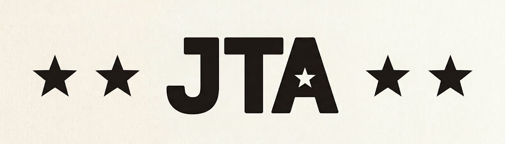

# JTA - Javascript Theft Auto



A TypeScript port of the Carnage3D game engine, built around Babylon.js and modern browser APIs.

> **Project status:** Phase 1, step 7 inclusive is implemented. The project is currently an engine/application shell and is not yet a complete playable port.

## Tech stack

- TypeScript
- Vite
- Babylon.js
- Cannon-es
- Howler
- Vitest
- ESLint
- Prettier

## Getting started

Install dependencies:

```bash
npm install
```

Start the development server:

```bash
npm run dev
```

Vite will start the application in development mode.

## Scripts

| Command | Purpose |
| --- | --- |
| `npm run dev` | Start the Vite development server |
| `npm run build` | Type-check the TypeScript project |
| `npm run bundle` | Create the production Vite bundle in `dist/` |
| `npm run preview` | Preview the production Vite bundle locally |
| `npm run test` | Run the Vitest test suite |
| `npm run lint` | Run ESLint |
| `npm run format` | Format the project with Prettier |

The `build` and `bundle` commands are intentionally separate:

- **build** validates TypeScript without emitting files.
- **bundle** runs the Vite production build used for deployment.

## GitHub Pages

The project is configured to be deployable as a Vite static site on GitHub Pages.

The expected production URL is:

**https://nelson-mig-l.github.io/javascript-theft-auto/**

The repository should use **GitHub Actions** as its Pages publishing source.

The deployment process should:

1. Install dependencies.
2. Run the TypeScript check with `npm run build`.
3. Create the production bundle with `npm run bundle`.
4. Publish the generated `dist/` directory to GitHub Pages.

### Deployment / Asset paths

Vite uses a relative base path so the generated site works both under the GitHub Pages repository URL and when served from the custom domain. Runtime asset paths should likewise remain relative (for example, `./assets`) rather than root-relative paths such as `/assets`.

If the deployment model changes, revisit these paths together; changing only one can cause assets to work in one hosting environment but fail in the other.

## Phase 1

Phase 1 establishes the basic runtime structure required before porting gameplay systems.

Current Phase 1 components include:

- TypeScript project configuration
- Vite application shell
- Babylon.js rendering setup
- Game engine and game loop
- State machine
- Input abstraction
- Keyboard and gamepad input classes
- Asset loader and asset manifest skeleton
- Placeholder menu and gameplay states
- Initial smoke tests

Some systems are intentionally skeletal at this stage. The goal is to establish the architecture and runtime foundation rather than implement the complete game.

## Architecture

The main runtime components are organized roughly as follows:

```text
src/
├── assets/       Asset loading and manifest
├── core/         Engine, game loop, and state machine
├── game/         Game states
├── graphics/     Babylon.js rendering
├── input/        Keyboard and gamepad input
├── physics/      Physics-related systems
└── __tests__/    Smoke/unit tests
```

The intended engine structure is centered around `GameEngine`, which coordinates rendering, input, assets, physics, and game state.

## Current limitations

This repository is still under active development. In particular:

- Gameplay systems are not yet fully implemented.
- Input systems exist but are not yet fully integrated into the runtime.
- The asset loader is currently a foundation/skeleton rather than a complete asset pipeline.
- Menu and gameplay states are placeholders.
- The test suite contains mocked Babylon.js components and does not replace testing in a real browser/WebGL environment.
- Production deployment requires the Vite bundle rather than the TypeScript type-check alone.

These are expected during the early porting phases and should not be interpreted as a finished-game feature set.

## Testing

Run the test suite with:

```bash
npm run test
```

For a quick development check, it is also useful to run:

```bash
npm run build
npm run bundle
```

## Development workflow

A typical development cycle is:

```bash
npm install
npm run build
npm run test
npm run bundle
npm run preview
```

Then continue implementing the next phase of the port.

## Roadmap

The immediate objective is to finish stabilizing the Phase 1 runtime foundation and then proceed with the gameplay systems required for the Carnage3D port.

Future phases will progressively replace placeholders with the original game's gameplay, assets, physics, input behavior, UI, and other systems.
